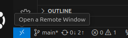

# Dev Container
## Flow
Prerequisites:
- VS Code
- Docker(Launched)
- [Dev Containers VS Code extension](https://marketplace.visualstudio.com/items?itemName=ms-vscode-remote.remote-containers)(you might as well install `Remote Development` extension pack)

Guide:
1. Clone and open this repository in VS Code
2. VS Code should prompt you to `Reopen in Dev Container`

If it did:

3. Agree and wait for the completion of setup

If it didn't:

3. in the bottom left connect find a blue rectangle with two arrows called Remote, press on it
4. in the opene menu select reopen in container
   
 

- For how to open GUI programs follow [GUI](#GUI) section
- For how to add extension follow [Extensions](#Extensions) section

### GUI
When you want to open gui for some application
1. enter a respective command(for launching it) in the terminal of dev container, e.g.:
```bash
gz sim
```
2. In the VS Code tab _Ports_ find port named `Desktop(Web)`
3. Ctrl+right click on the _Forwarded Address_ to the right of the `Desktop(Web)`(usually it should be on [localhost:6080](http://localhost:6080/) but if that port is taken, it will start on the next free one).
3. In the browser a tab for noVNC should open(it might take some time to load). Press connect and you should be able to see a gui for desktop with the program you opened.
4. Or you can open and enter it in the browser url bar yourself.


If you want to resize gui window to better fit your screen, you need: 
1. can find a dotted button with white arrow to the middle left of the screen
2. press on settings(cog icon)
   1. you can also enable full screen mode(icon on top of the settings one)
3. in scaling mode select `Remote Resizing`. In `Advanced` you can also adjust the quality of transmission

 

If you want to open a terminal inside that GUI:
1. find a black right-side looking triangle in the left bottom of the screen
2. Press on `Terminal`

If you don't see a `ros@<some_number>`, then type `bash`. Otherwise you are good to go

## Extensions
You can find a list of extensions in `docker/devcontainer.json` > `customizations -> vscode -> extensions`.

To add your own extension, find its page on "Extensions" VS code page click on the cog(settings button) and:
- press "copy extension id" and add it to the list in `devcontainer.json`
- press "add to devcontainer"

To add copilot to your dev container you can follow the [advices from stackoverflow](https://stackoverflow.com/questions/75380181/how-can-you-get-copilot-to-turn-on-in-all-dev-containers-in-vs-code) 


## Errors
### `/var/run/user/1000 (Permission denied)`
Ctrl+c the application, run:
`sudo chown ros:ros /var/run/user`

Reopen the application

## GUI
T


```bash
rhost +local:
```

## Multiple configurations
A single configuration might simply be in a root level of `.devcontainer` like `.devcontainer/devcontainer.json`.

To have multiple dev container configurations you would need to create a separate subdirectory for each one(going beyond one subdirectory deep isn't allowed):
- 🟢 `.devcontainer/ros/devcontainer.json`, `.devcontainer/ros_gazebo/devcontainer.json`
- ⭕ `.devcontainer/ros/ros/devcontainer.json`, `.devcontainer/ros/gazebo/devcontainer.json`

## Rebuilding

gh codespace rebuild

Tip: You may occasionally want to perform a full rebuild to clear your cache and rebuild your container with fresh images. For more information, see "Rebuilding the container in a codespace."

## References
- List of all docker images for ROS1/2 and Gazebo(classic) from OSRF on [github](https://github.com/osrf/docker_images/tree/master)
- An exhaustive(?) guide for ros2 dev container https://www.allisonthackston.com/articles/vscode-docker-ros2.html
- Great template with some explanations, Features explanations for GPUs on WSL https://github.com/athackst/vscode_ros2_workspace/tree/humble

- https://docs.github.com/en/codespaces/setting-up-your-project-for-codespaces/adding-a-dev-container-configuration/introduction-to-dev-containers#using-a-predefined-dev-container-configuration

- https://www.youtube.com/watch?v=dihfA7Ol6Mw
- https://github.com/Eruvae/ROS-devcontainer/blob/main/ros2/.devcontainer/devcontainer.json

- https://github.com/brean/gz-sim-docker/tree/main
- https://gazebosim.org/docs/citadel/ign_docker_env/